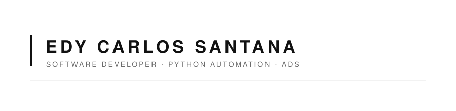

<div align="center">
  
</div>

<br/>

```bash
edy@dev:~$ whoami
```
```
Análise e Desenvolvimento de Sistemas.
Entusiasta por tecnologia, desenvolvimento de software e automação.
Explorando Python para construir automações do dia a dia.
Sempre aprendendo — sem pressa, sem pausa.
```

<br/>

<div align="center">

**Stack**

`Python`&nbsp;&nbsp;·&nbsp;&nbsp;`JavaScript`&nbsp;&nbsp;·&nbsp;&nbsp;`HTML`&nbsp;&nbsp;·&nbsp;&nbsp;`CSS`&nbsp;&nbsp;·&nbsp;&nbsp;`Bootstrap`&nbsp;&nbsp;·&nbsp;&nbsp;`Git`

</div>

<br/>

<div align="center">

**Contribuições**

<picture>
  <source media="(prefers-color-scheme: dark)" srcset="https://raw.githubusercontent.com/DyCarlosSantana/DyCarlosSantana/output/github-contribution-grid-snake-dark.svg" />
  <source media="(prefers-color-scheme: light)" srcset="https://raw.githubusercontent.com/DyCarlosSantana/DyCarlosSantana/output/github-contribution-grid-snake.svg" />
  
</picture>

</div>

<br/>

<div align="center">


</div>

<br/>

<div align="center">

[LinkedIn](https://www.linkedin.com/in/carlos-santana-a206222b0/) · [Instagram](https://www.instagram.com/dycarlos_ss/) · [Reddit](https://www.reddit.com/user/Carlitusss/) · [Gumroad](https://dycarlos.gumroad.com/l/SeconBrain-pixel)

</div>
